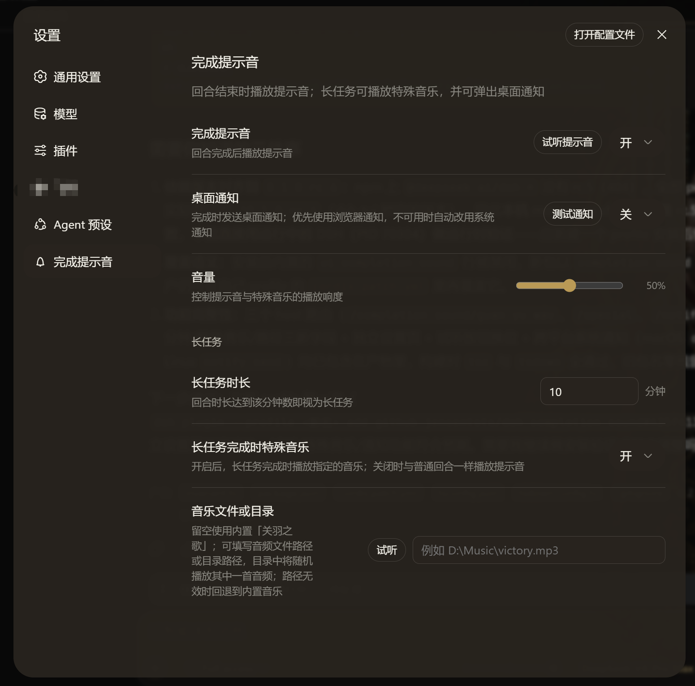

# dsh-completion-sound

DSH（DeepSeek Harness）完成提示音插件（bundle）：agent 回合完成时播放提示音；长任务（默认 ≥ 10 分钟）完成时播放「关羽之歌」特殊音乐并弹出可点击停止的模态框；可选触发桌面通知（浏览器通知优先，不可用时自动回退系统通知）。

> 包名：`@jensentsts/dsh-completion-sound` · 版本：`0.1.0` · License：MIT

[English](README.md) | [中文](README.zh.md)

## 设置页



## 安装

```bash
dsh plugin --profile web add github:jensentsts/dsh-completion-sound
```

构建产物（`lib/`）已随仓库提交，因此从 git 安装**无需** pnpm 构建授权（pnpm ≥10 的 `allowBuilds`）；`dsh plugin add` 拉取后直接可用。

> 锁定提交以避免后续推送悄悄改变运行内容：
> `dsh plugin --profile web add github:jensentsts/dsh-completion-sound#<sha>`

## 与内置完成提示音的关系

`dsh-web-app` 组合包内置了一个完成提示音行（`ui-completion-sound` → `@deepseek-ai/dsh-client-ui-completion-sound`）。本 bundle 的 `cordis.patch.yml` 会**禁用该内置行**并插入自己的行（id `completion-sound`），因此在一个 web profile 里同时装了 `dsh-web-app` 和本插件时，由本插件接管完成提示音，不会重复播放。在没有 `dsh-web-app` 的 profile 里，禁用步骤被静默跳过，插入步骤照常生效。

## 功能特性

- **完成提示音**：回合完成时播放 WebAudio 合成的双音提示音（E5 → A5）
- **长任务特殊音乐**：长任务完成时播放特殊音乐，并弹出模态框，点击任意处停止
- **自定义特殊音乐**：可指定单个音频文件，或指定一个目录（每次随机播放其中一首）
- **内置音频**：默认使用内置的「关羽之歌」（`assets/guan-yu.wav`，约 13.5 MB）
- **长任务阈值可配**：1 分钟 ~ 10080 分钟（7 天）
- **桌面通知**：可选，跨平台——优先浏览器通知，不可用时自动回退系统通知（macOS `osascript` / Linux `notify-send`）
- **独立设置页**：所有设置整合在「设置 → 完成提示音」页面

## 设置项

| 字段 | 说明 | 默认值 | 范围 |
| --- | --- | --- | --- |
| `enabled` | 完成提示音开关 | `true` | — |
| `notify` | 桌面通知开关 | `false` | — |
| `volume` | 音量 | `0.5` | 0–1 |
| `longTaskMinutes` | 长任务时长阈值（分钟） | `10` | 1–10080 |
| `special` | 长任务完成时播放特殊音乐 | `true` | — |
| `specialPath` | 特殊音乐文件/目录路径（空 = 内置关羽之歌） | `""` | — |

## 特殊音乐语义

`specialPath` 的值决定长任务完成时播放什么：

- **空字符串** → 播放内置的 `assets/guan-yu.wav`
- **文件路径** → 播放该文件（按扩展名判定 content-type）
- **目录路径** → 递归扫描目录下的音频文件（`.aac` `.flac` `.m4a` `.mp3` `.oga` `.ogg` `.opus` `.wav` `.webm`，上限 512 首），每次随机播放一首

> 特殊音乐的试听按钮位于「音乐文件或目录」输入框的左侧；输入后先提交路径再试听，保证试听的是当前填写的路径。

## 目录结构

```
completion-sound/
├── assets/
│   └── guan-yu.wav              # 内置「关羽之歌」音频（约 13.5 MB）
├── img/
│   └── settings.png             # 设置页截图
├── src/
│   ├── index.ts                 # Host 半边：设置 schema + 音频/通知路由
│   ├── settings.ts              # 设置字段常量与类型
│   ├── invariant.ts             # 内部断言（invariant companion）
│   ├── css-modules.d.ts         # CSS Modules 类型声明
│   └── client/
│       ├── index.ts             # Client 半边：设置绑定 + 完成监听 + 设置页注册
│       ├── CompletionSoundSection.tsx  # 独立设置页组件
│       ├── CompletionSoundSection.module.css
│       ├── settings-store.ts    # 设置 store（defineStore）
│       ├── sound.ts             # WebAudio 合成 / 音频加载与播放 / 停止控制
│       ├── notify.ts            # 桌面通知（浏览器优先 + 系统通知兜底）
│       ├── stop-modal.tsx       # 可点击停止的模态框
│       ├── stop-modal.module.css
│       └── locales.ts           # zh/en 文案
├── lib/                         # 构建产物（已提交，git 安装免构建）
│   ├── index.js                 # Host 半边
│   ├── invariant.js
│   ├── client.js                # Client 半边（browser bundle）
│   └── types/**/*.d.ts          # 类型声明
├── package.json
├── cordis.patch.yml             # bundle patch（禁用内置行 + 插入本插件行）
├── tsconfig.json
├── tsdown.config.ts
├── LICENSE
├── README.md
└── README.zh.md
```

## 架构说明

本插件是一个 **DSH 组合包**（bundle），`package.json` 的 `dsh.bundle.patch` 指向 `cordis.patch.yml`，同时声明 `dsh.client`（platform `web`）让模块加载器把 client 半边 serve 到浏览器。

- **Host 半边**（`src/index.ts`）：向设置子系统注册 schema，并注册三个路由：
  - `/completion-sound/guan-yu.wav` — 内置关羽之歌（内存缓存后以 `audio/wav` 输出）
  - `/completion-sound/special` — 按 `specialPath` 服务特殊音乐（空→内置；文件→serve；目录→随机选一首，响应头带 `x-dsh-completion-sound-random: 1`）
  - `/completion-sound/notify` — POST 系统通知兜底（macOS `osascript` / Linux `notify-send`），浏览器通知不可用时的跨平台降级
- **Client 半边**（`src/client/index.ts`）：绑定设置、监听回合完成事件，在「设置」中注册 `settings.section`（id `completion-sound`）独立页。

## 构建

构建产物已提交到仓库，普通用户无需构建。开发者修改 `src/` 后重新构建：

```bash
pnpm install
pnpm run build      # tsc -p tsconfig.json && tsdown
pnpm run typecheck  # tsc -p tsconfig.json --noEmit
```

产物（`lib/`，已提交）：

- `lib/index.js` — host 半边
- `lib/invariant.js` — invariant companion
- `lib/client.js` — client 半边（browser bundle）
- `lib/types/**/*.d.ts` — 类型声明

`tsdown.config.ts` 是自包含的（内联了平台模块表、CSS Modules 内联插件与 `__ModuleLoader__` 装载格式），不依赖任何 monorepo 预设。

## 依赖说明

- **dependencies**：运行时值依赖（`@deepseek-ai/dsh-settings`、`@deepseek-ai/schemastery`、`react`、`react-dom`）
- **peerDependencies**：由宿主 DSH profile 提供的服务（`@deepseek-ai/cordis`、`dsh-api-remotes`、`dsh-client-*`、`dsh-invariants`），版本对齐 `0.1.0-rc.6`
- **devDependencies**：类型检查与构建工具（TypeScript、tsdown、tsx、lightningcss）

## 系统通知依赖

桌面通知的系统兜底在 Linux 上依赖 `notify-send`（`libnotify-bin`，多数桌面发行版自带）；macOS 依赖内置 `osascript`。浏览器通知可用时不会走系统兜底。

## License

MIT，见 [LICENSE](LICENSE)。
